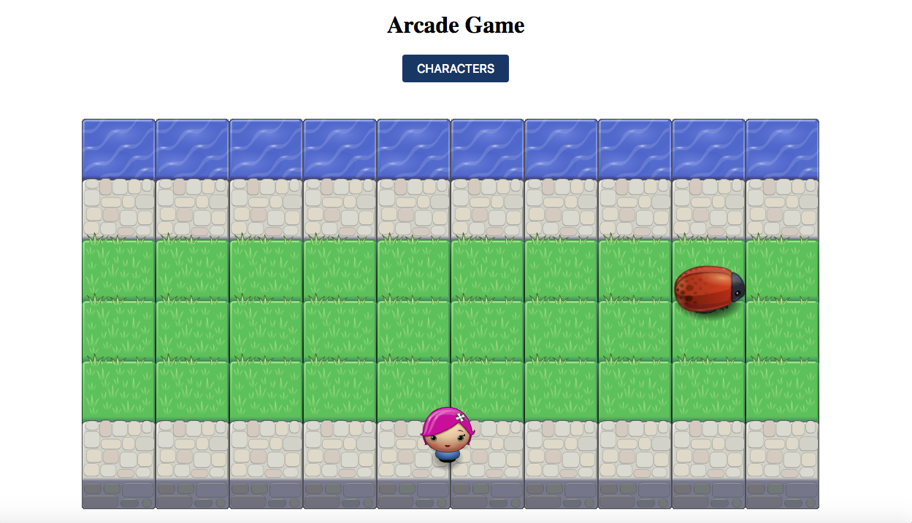

Arcade Game
===============================

#How to run the game
Download or clone repository. Load index.html in your favorite browser and start playing.

##How to Play
Use your keyboard arrows up, left, down or right to move your character towards the water. Once you reach the water you will score points and advance level. As you advance level, it will get harder.

##Goal
Get as many points as possible.

##Play Game

Play the game [link](https://lmedinatriana.github.io/Classic-Arcade-Game/)

Frogger Game Description
===============================

Project from the Front-End Web Developer Nanodegree by Udacity: 

⋅⋅*Object-Oriented JavaScript
⋅⋅*HTML5 Canvas

##Basic Functionality
In this game you have a Player and Enemies (Bugs). The goal of the player is to reach the water, without colliding into any one of the enemies. The player can move left, right, up and down. The enemies move in varying speeds on the paved block portion of the scene. Once a the player collides with an enemy, the game is reset and the player moves back to the start square. Once the player reaches the water the game is won.